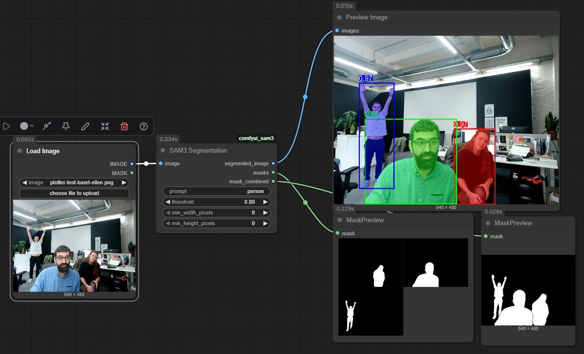

# ComfyUI SAM3

ComfyUI custom node pack for **SAM3 (Segment Anything Model 3)** - Meta's state-of-the-art image segmentation model. This extension enables text-prompt-based object segmentation directly within your ComfyUI workflows.

## Overview

SAM3 is a powerful zero-shot segmentation model that can identify and segment objects in images using natural language prompts. This custom node pack brings SAM3's capabilities to ComfyUI, allowing you to:

- Segment objects using text descriptions (e.g., "person", "car", "dog")
- Filter results by confidence threshold
- Control minimum object dimensions
- Output individual masks for each detected object
- Generate a combined mask of all detections
- Visualize results with colored overlays, bounding boxes, and confidence scores



## Quickstart

1. Clone this repository under `ComfyUI/custom_nodes`.
2. Install the dependencies:
   ```bash
   pip install -r requirements.txt
   ```
3. Request model access at https://huggingface.co/facebook/sam3
4. Login to huggingface using ``hf auth login``
5. Restart ComfyUI.
6. Load example workflow from ``workflow_example/Workflow_SAM3_image_text.json``

## Features

### SAM3 Segmentation Node

**Inputs:**

- **image** - Input image to segment
- **prompt** (STRING) - Text description of objects to segment (e.g., "person", "car", "building")
- **threshold** (FLOAT, 0.0-1.0) - Minimum confidence score threshold for detections (default: 0.5)
- **min_width_pixels** (INT) - Minimum bounding box width in pixels (default: 0)
- **min_height_pixels** (INT) - Minimum bounding box height in pixels (default: 0)

**Outputs:**

- **segmented_image** (IMAGE) - Visualization with colored mask overlays, bounding boxes, and confidence scores
- **masks** (MASK) - Batch of individual binary masks, one for each detected object `[B, H, W]`
- **mask_combined** (MASK) - Single merged mask containing all detected objects `[1, H, W]`

**Example Use Cases:**

- Remove backgrounds by segmenting people or objects
- Isolate specific elements in a scene for further processing
- Create masks for inpainting workflows
- Generate batch masks for multiple objects of the same type
- Filter detections by size to focus on foreground/background objects
